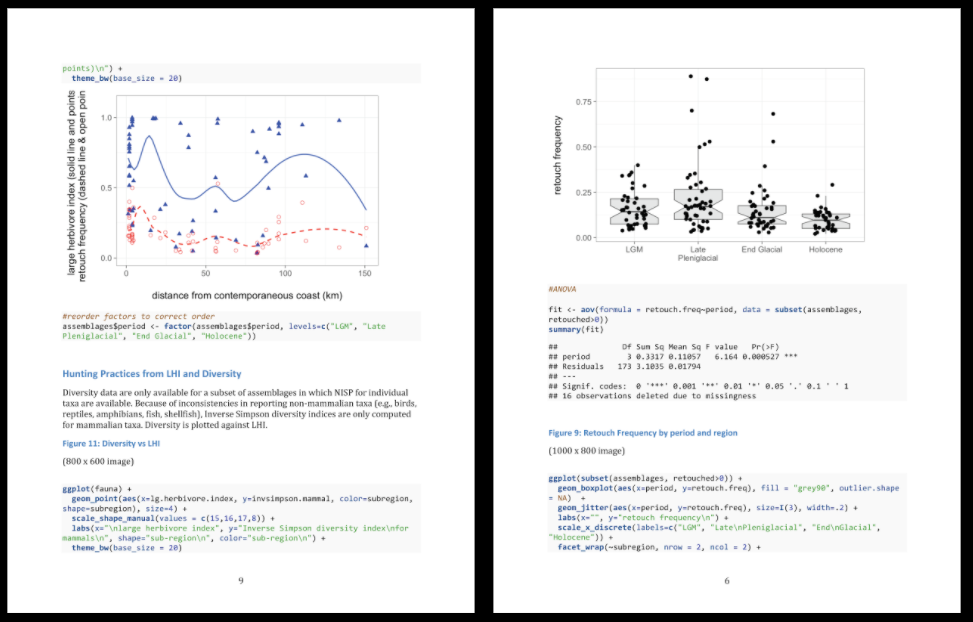
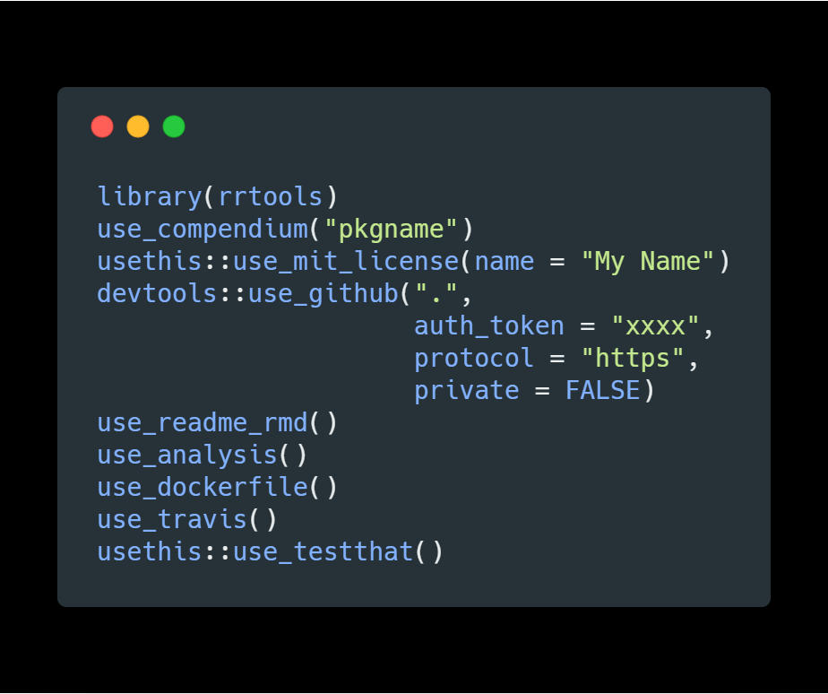
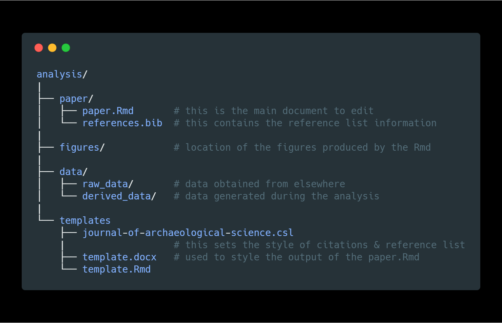

<!-- This is the format for text comments that will be ignored during renderings. Do not put R code in these comments because it will not be ignored. -->

```{r, setup, echo = FALSE, message = FALSE, warning = FALSE}
knitr::opts_chunk$set(
  collapse = TRUE,
  warning = FALSE,
  message = FALSE,
  echo = FALSE,
  cache = TRUE,
  comment = "#>",
  fig.height=5,
  fig.width=5,
  fig.path = "../figures/"
)

library(caa2018) # Or use devtools::load_all('.', quiet = T) if your code is in script files, rather than as functions in the `/R` diretory

library(ggrepel)
library(tidyverse)
library(glue)
library(tidytext)
library(scales)
library(ggpmisc)
library(Hmisc)
```

# Narrative to accompany the slides for our talk 

These are our notes for preparing our slides for our CAA2018 presentation in the session "R as an archaeological tool: current state and directions" (https://github.com/MartinHinz/isaak_conf_sessions/tree/master/caa_2018_tuebingen)

## Slide: Title slide    

*Reproducible research in archaeology using R & rrtools*: In this talk, we will show  how archaeologists are changing their data analysis practices to make their research more reproducible and open. We will introduce the rrtools package, which is our specific contribution to help with the challenge of making reproducible research in archaeology easier. 

## Acknowledgements

Our project comes from the group who took part in the 2017 Summer School on Reproducible Research in Landscape Archaeology at the Freie Universität Berlin (17-21 July), funded and jointly organized by Excellence Cluster 264 Topoi, the Collaborative Research Center 1266, and ISAAKiel. 

## Slide: Motivation & Outline

 _Motivation_ 
 
Our motivation for this topic arises from a profound change that we have been observing in how researchers analyse their data.

Increasingly, we are seeing researchers publishing research that uses a programming language to calculate their models. Similarly, we see journal articles accompanied by scripts of programming language so that readers can study the details of the data analysis methods. 

This is an important change away from using mouse-driven, point-and-click software for data analysis. When archaeologists use software such as SPSS and Past (as you see in our screenshots here), it is very difficult for them to share the details of their calculations. When readers cannot see the details of an analysis, it is difficult for them to be confident in the results described in an article. Also, for other researchers it may be near impossible to implement the described methods in their own work as they lack the details on how to come to the desired conclusions. 

_Outline_

In this presentation we will briefly review some data showing change in the use of programming languages in the sciences generally, and in archaeology in particular. We focus on the R programming language, because this is by far the most widely used language in archaeology. 

Secondly, we will review how R is used by archaeologists, to show the potential that using a programming language has for opening and accelerating archaeological research. 

Finally, we will briefly introduce our R package, rrtools, which is designed to simplify and standardise the process of using R for archaeology, and making research more open and reproducible. 

## Slide: Current uses of R [signpost slide only]
So, let's start with the current uses of R.

## Slide: Articles in all sciences citing R 

```{r all-sciences-citing-r}

# We did a 'Cited Reference Search' in WoS for title "R: A Language and Environment for Statistical Computing" and author = "R Core Team", which is the output from  `citation()`. This function first appeared in 2004 https://github.com/wch/r-source/commits/9a5c086855d2e8fb07f670e3315871b2de31a4fd/src/library/base/inst/CITATION 
# 
# Note that before 2012 the authors were "R Development Core Team", and then it was simplified to "R Core Team" https://github.com/wch/r-source/commit/9a5c086855d2e8fb07f670e3315871b2de31a4fd#diff-80bb8a8b133a6204e9642d76791927e2
# 
# This is our exact search string for WoS:
# 
# You searched for: CITED AUTHOR: ("R DEV COR TEAM" OR "R CORE" OR "R CORE TEAM") AND CITED WORK: ("R: A Language and Environment for Statistical Computing") AND LANGUAGE: (English) AND DOCUMENT TYPES: (Article)
# Timespan: All years. Indexes: SCI-EXPANDED, SSCI, A&HCI, ESCI.

cran_cites_files <- 
    paste0(here::here(), glue("/analysis/data/raw_data/cited_cran/savedrecs ({1:11}).txt"))

cran_cites_all_areas_all_years <- 
  map(cran_cites_files,
      ~readr::read_tsv(.x, 
                       quote = "",
                       col_types = cols(.default = col_character()))) %>% 
  bind_rows() %>% 
  mutate(PY = as.numeric(PY)) %>% 
  filter(PY <= 2017)

# limit to top journals
top_journals_for_cran_cites <- 
  cran_cites_all_areas_all_years %>% 
  group_by(SO) %>% 
  tally(sort = TRUE)

how_many_articles_in_top_journals_for_cran_cites <- 
  sum(top_journals_for_cran_cites$n)

top_journals_for_cran_cites_articles_per_year <- 
  read_csv(str_glue('{here::here()}/analysis/data/raw_data/top_journals_for_cran_cites_articles_per_year.csv')) %>% 
  select(-X1) %>% 
  gather(variable, value, -year) %>% 
  separate(variable, 
           into = str_glue('X{1:4}'), 
           by = "_") %>% 
  select(year, X4, value)
           
# tally by year
cran_cites_all_areas_top_journals_by_year <- 
  cran_cites_all_areas_all_years %>% 
  filter(SO %in% top_journals_for_cran_cites$SO[1:10]) %>% 
  group_by(SO, PY) %>% 
  tally(sort = TRUE) %>% 
  mutate(journalname = str_remove_all(SO, " |-"),
         PY = as.integer(PY)) %>% 
  left_join(top_journals_for_cran_cites_articles_per_year,
            by = c('journalname' = 'X4', 
                   'PY' = "year")) %>% 
  mutate(prop = n / value ) %>% 
  filter(SO != 'JOURNAL OF STATISTICAL SOFTWARE') %>% 
  ungroup()
 

min_y <- 2007
max_y <- 2025
ggplot(cran_cites_all_areas_top_journals_by_year,
       aes(PY,
           prop,
           colour = SO)) +
  geom_line(size = 2) +
  geom_text_repel(
    data = subset(cran_cites_all_areas_top_journals_by_year, 
                  PY == max(PY)),
    aes(label = str_wrap(SO, 40)),
    size = 4,
    nudge_x = 0,
    hjust = 0,
    segment.color = NA,
    direction = "y"
  ) +
   annotate("text", x=2019, y=-0.01, label= "n = 50380") +
   scale_x_continuous(breaks = min_y:max_y,
                     labels = c(min_y:2017, rep("", length(2018:max_y))),
                     limits = c(min_y, max_y)) +
  scale_y_continuous(labels = scales::percent) +
  xlab("Publication year") +
  ylab("Percentage of articles in that journal") +
  theme_minimal() +
  theme(legend.position="none",
        axis.text.x = element_text(angle = 90, hjust = 1, vjust = 0.5)) +
  ggtitle(str_glue('Percentage of articles per year citing R in top 10 WoS journals ({prettyNum(how_many_articles_in_top_journals_for_cran_cites,",")} articles)'),
          subtitle = "Data from apps.webofknowledge.com,\nusing in SCI-EXPANDED & SSCI for 2007-2017")


ggsave(filename = "all_sciences_citing_R_over_time.png",
       path = str_glue('{here::here()}/analysis/figures'),
       height = 5,
       width = 9)
```

This plot shows how data analysis is changing in the sciences more broadly towards the use of the R programming language. We searched the Web of Science, produced by Clarivate Analytics, for citations to the R program over the last ten years, and filtered the results to the top ten journals with the highest number of citations to this software. The purpose of this filtering step was to find areas of research were R is generally known, so we can see how its use is changing over time. Note that many articles that use R do not cite the R program, so these numbers underestimate the true use of R in science. 

We can make two major observations: 

**First**, the areas of science that have seen big growth in the use of R are ecology, evolution and related biological sciences. This is especially significant for us archaeologists, as ecology and biology are subjects from which we quite often adapt methods for analysis, as for example in point-pattern-analysis and statistical modelling. 
We also see increases in multi-disciplinary journals such as PeerJ and PLOS One. 

**Second**, the scale of the increases is quite impressive: Starting only 2012 some journals now have 20% of articles citing R. 

So, we can see this is a substantial change in the way researchers are working in many fields. What about archaeology? Do we also see a change like this?

## Slide: Archaeology articles citing R

```{r top-archaeology-journals-by-citations-of-r}

# Data are from an 'advanced search' of apps.webofknowledge.com using WC=Archaeology on apps.webofknowledge.com.

# get the top archaeology journals by numbers of articles.
wc_archaeology_2017 <- 
  readr::read_tsv(paste0(here::here(), "/analysis/data/raw_data/savedrecs.txt"), 
            quote = "")

# The 10 journals with the most articles are:
top_journals_by_articles <- 
wc_archaeology_2017 %>% 
  group_by(SO) %>% 
  tally(sort = TRUE) 

# For 2007-2017:

data_files_from_2007_to_2017 <- 
  paste0(here::here(), glue("/analysis/data/raw_data/savedrecs ({1:2}).txt"))

wc_archaeology_2007_to_2017 <- 
  map(data_files_from_2007_to_2017,
      ~readr::read_tsv(.x, quote = "")) %>% 
  bind_rows()

total_number_of_articles_in_sample <- 
  nrow(wc_archaeology_2007_to_2017) 

# most populararchaeology journals over time, that have some mention of R
most_popular_journals_over_time <- 
wc_archaeology_2007_to_2017 %>% 
  group_by(SO, PY) %>% 
  tally(sort = TRUE) %>% 
  filter(!SO %in% c("JOURNAL OF CULTURAL HERITAGE",
                    "STUDIES IN CONSERVATION",
                    "INTERSECCIONES EN ANTROPOLOGIA",
                    "ISRAEL EXPLORATION JOURNAL",
                    "JOURNAL OF MATERIAL CULTURE",
                    "TRABAJOS DE PREHISTORIA",
                    "ARCHEOSCIENCES-REVUE D ARCHEOMETRIE")) %>% 
  filter(n >= 2) %>% 
  ungroup()

most_popular_journals_over_time_names <- 
  unique(most_popular_journals_over_time$SO)

archy_journals_total_number_of_articles <- 
  read_csv(str_glue('{here::here()}/analysis/data/raw_data/top_archaeology_journals_articles_per_year.csv'))

top_archaeology_journals_articles_per_year <- 
  archy_journals_total_number_of_articles %>% 
  gather(variable, value, -journal_name) %>% 
  mutate(year = as.numeric(variable)) %>% 
  select(-variable)
  
cran_cites_in_archy_journals <- 
  cran_cites_all_areas_all_years %>% 
  filter(SO %in% most_popular_journals_over_time_names)

# what archaeology journals cite R?
# unique(cran_cites_in_archy_journals$SO)

archy_journals_total_number_of_citing_articles <- 
  nrow(cran_cites_in_archy_journals)

cran_cites_in_archy_journals_per_year <- 
  cran_cites_in_archy_journals %>% 
  group_by(SO, PY) %>% 
  tally(sort = TRUE) %>% 
  ungroup() %>% 
  mutate(PY = as.numeric(PY))  %>% 
  left_join(top_archaeology_journals_articles_per_year,
            by = c("SO" = "journal_name",
                   "PY" = "year")) %>% 
  mutate(prop = n / value) %>% 
  group_by(SO) %>% 
  mutate(jn = str_glue('{SO} (n = {sum(n)})')) %>% 
  ungroup()

min_y <- 2007
max_y <- 2040


jas_cites_r <- 
cran_cites_in_archy_journals_per_year %>% 
  filter(SO == "JOURNAL OF ARCHAEOLOGICAL SCIENCE") %>% 
  ggplot(aes(PY,
           prop)) +
  geom_point(size = 4) +
  geom_smooth(method = "lm",
              se = FALSE) +
  stat_poly_eq(aes(label =  paste(..eq.label.., 
                                  ..adj.rr.label..,
                                  sep = "~~~~")),
               formula = y~x, 
               parse = TRUE,
               size = 3,
               label.y.npc = 0.7) +
  stat_fit_glance(label.y.npc = 0.7,
                  size = 3,
                  method = "lm", 
                  method.args = list(formula = y ~ x),
                  geom = "text",
                  aes(label = paste("p-value: ",signif(..p.value.., digits = 4)))) +
  xlab("year") +
  ylab("Proportion of articles citing R") +
  ggtitle(expression(paste("Articles citing R in ", italic("Journal of Archaeological Science")))) +
  theme_bw(base_size = 6)
  
ggplot(cran_cites_in_archy_journals_per_year,
       aes(PY,
           prop,
           colour = SO)) +
  geom_line(size = 2) +
  geom_text_repel(
    data = subset(cran_cites_in_archy_journals_per_year, 
                  PY == max(PY)),
    aes(label = jn),
    direction = "y",
    size = 5,
    nudge_x = 1,
    hjust = 0) +
  theme_minimal() +
  theme(legend.position="none",
        axis.text.x = element_text(angle = 90, hjust = 1, vjust = 0.5)) +
  scale_x_continuous(breaks = min_y:max_y,
                     labels = c(min_y:2017, rep("", length(2018:max_y))),
                     limits = c(min_y, max_y)) +
  scale_y_continuous(labels = scales::percent) +
  xlab("Publication year") +
  ylab("Percentage of articles in that journal") +
  ggtitle(str_glue('Percentage of Archaeology articles per year citing R ({archy_journals_total_number_of_citing_articles} out of {prettyNum(total_number_of_articles_in_sample, ",")} articles in sample)'),
          subtitle = "Data from apps.webofknowledge.com,\nusing in SCI-EXPANDED & SSCI for 2007-2017")  +
  annotation_custom(grob = ggplotGrob(jas_cites_r), 
                          xmin = 2030, xmax = 2040, 
                          ymin = 0.10, ymax = 0.17)

ggsave(filename = "all_archaeology_citing_R_over_time.png",
       path = str_glue('{here::here()}/analysis/figures'),
       height = 6,
       width = 10)
```

Here are the results for archaeological articles. We found `r archy_journals_total_number_of_citing_articles` articles that cite R over the last ten years. Note that this is certainly not complete, since these are just the journals tracked by the Web of Science database, and we know that archaeologists publish in a great variety of journals.

There are three important details in these plots:

The **first** detail we see here is that overall, the proportions and the absolute number of articles citing R in archaeology are much smaller than what we see in the ecology journals on the previous slide. Only the _Journal of Archaeological Science_ has more than 10 articles in our sample. It's obvious, we have yet to adopt programming for data analysis in the same way that ecologists have. 

The **second** detail is that we do not see a significant increase over time. Both archaeology and the other sciences we saw on the previous slide show an increase in citing R at around 2013-2014, but we do not yet see much of an upward trend in the archaeology journals. Indeed, in several of our journals the first citations of R only occured in the last two years. The plot on the upper right of this slide shows a statistical test of change over time for articles in JAS. With a low r-squared value and high p-value for the linear model, we conclude that there is no evidence for an increase in citations over time in this journal.  

The **third** detail we see is the distinctive types of journals that have articles citing R. There is a clear focus on scientific archaeology, with _Journal of Archaeological Science_ having the highest total number of articles. Archaeology as a subject has always been situated between a humanistic and a scientific tradition, but studies using statistical methods lean towards the sciences, which we mean with the term "scientific archaeology". We also see geoarchaeology, lithics, and environmental archaeology represented in the journal names. We can investigate this further with statistical analysis of the words in the titles of all the articles in our sample.

## Slide: What are archaeologists doing with R?


```{r text-mining-article-titles-archaeology}
# https://www.tidytextmining.com/twitter.html

# These are all archy articles
# wc_archaeology_2007_to_2017

# These are ones citing R
# cran_cites_in_archy_journals

# subtract ones citing R from ones that do not

wc_archaeology_2007_to_2017_no_R_cites <- 
  wc_archaeology_2007_to_2017 %>% 
  filter(TI %nin% cran_cites_in_archy_journals$TI)

# we have a very skewed sample, so let's match 
cran_cites_in_archy_journals_lots <- 
  cran_cites_in_archy_journals %>% 
  sample_n(nrow(wc_archaeology_2007_to_2017_no_R_cites),
           replace = TRUE)

# combine
archy_journal_articles <- 
  bind_rows(wc_archaeology_2007_to_2017_no_R_cites %>% 
            mutate(ID = "no_R_cites",
                   VL = as.character(VL)),
           cran_cites_in_archy_journals %>% 
            mutate(ID = "has_R_cites"))


tidy_cites <- 
archy_journal_articles %>% 
  unnest_tokens(word, TI) %>%
  filter(!word %in% c(stop_words$word, "archaeology", 
                      "archaeological",
                      "analysis", "study", "site"),
         str_detect(word, "[a-z]"))

frequency <- 
  tidy_cites %>% 
  group_by(ID) %>% 
  count(word, sort = TRUE) %>% 
  left_join(tidy_cites %>% 
              group_by(ID) %>% 
              summarise(total = n())) %>%
  mutate(freq = n/total)

frequency <- frequency %>% 
  select(ID, word, freq) %>% 
  spread(ID, freq) %>%
  arrange(no_R_cites, has_R_cites)


ggplot(frequency, 
       aes(no_R_cites, 
           has_R_cites)) +
    geom_abline(color = "red", 
              size = 2) +
  geom_jitter(alpha = 0.1, 
              size = 2.5, 
              width = 0.25, 
              height = 0.25) +
  geom_text_repel(aes(label = word), 
            size = 5,
            segment.colour = NA) +
  scale_x_log10(labels = percent_format(),
                limits = c(0.001, 0.02)) +
  scale_y_log10(labels = percent_format()) +

  theme_minimal(base_size = 16) +
  xlab("Articles that do not cite R") +
  ylab("Articles that cite R") +
  ggtitle("Comparing the frequency of words used in archaeology articles")

ggsave(filename = "archaeology_articles_word_freqs.png",
       path = str_glue('{here::here()}/analysis/figures'),
       height = 9,
       width = 9)
```

Here we see a comparison of word frequencies of the titles of archaeology journal articles. Words near the red line are used with about equal frequencies by papers that cite R and by papers that do not cite R. Words far away from the red line are used much more by one group of articles compared to the other. 

This plot supports our initial observations: archaeologists using R tend to be doing more scientific archaeology. We see that many words relating to stone artefacts, zooarchaeology, and geoarchaeology are more frequently used by R-using archaeologists. On the other hand, articles that do not cite R more often discuss the Neolithic and metal-age periods, and less often reflect a technical specialisation. 

## Slide: The unrealised potential of R for reproducible research [signpost slide only]
After this overview how R is being used at the moment, we want to focus on the possibilities of making research reproducible using R.

## Slide 9: The unrealised potential of R for reproducible research 


We would now like to focus on those archaeological papers using R, that are demonstrating the potential of R for open and reproducible research. These papers are using R Markdown for their research, which is shown in this figure.

On the left we see a plain-text document written in R Markdown. This means that is has lines of code in amongst lines of normal text. We can format the text with simple additions, such as the underscore to indicate italics and the hash symbol to indicate a heading. These simple additions are Markdown, a very easy markup language with plain text formatting syntax. It is designed so that it can be converted to HTML and many other formats. **R** Markdown allows us to mix R code and text in the same document. Here we see a short snippet of R code right inside the text (nrow(cars)) as well as a longer block of code below.

When this R Markdown document is rendered, or converted to another format such as PDF or Microsoft Word, we see that the code is replaced by the output it generates. On the right side of this figure we see that the inline code has been replaced by the number 50, and the code block below has been replaced by the plot. 

We have found that some archaeologists are writing their entire journal articles useing R Markdown, and they share their plain-text R Markdown document along with their publication. This means that the reader can see all of the details of the data analysis, and all of the small decisions made along the way. This way the analysis is easily reproducible for others. 

## Slide: Real-world example from Barton et al. 2018



Here is a real-world example R Markdown in use, from an archaeology article published in 2017. 

## Slide: An increasing number of archaeologists are publishing reproducible research 

```{r}
archy_ctv_readme <- readLines(str_glue('{here::here()}/analysis/data/raw_data/ctv-archaeology-README.md'))

top_archy_journals <-
 str_subset(archy_ctv_readme, "Journal of Archaeological Method and Theory|J Archaeol Sci|Journal of Anthropological Archaeology|Journal of Archaeological Science")

top_archy_journal_names <-
  unlist(str_extract_all(archy_ctv_readme, "Journal of Archaeological Method and Theory|J Archaeol Sci|Journal of Anthropological Archaeology|Journal of Archaeological Science"))


top_archy_journal_names <- ifelse(top_archy_journal_names == "J Archaeol Sci",
                                  "Journal of Archaeological Science",
                                  top_archy_journal_names)

archy_ctv_readme <- top_archy_journals
archy_ctv_readme <- str_remove_all(archy_ctv_readme, "[[:punct:]]")
archy_ctv_readme_20XX <- str_extract(archy_ctv_readme, " 20[[:digit:]]{2} ")
archy_ctv_readme_20XX <- str_squish(unlist(archy_ctv_readme_20XX))
archy_ctv_readme_20XX <- as.numeric(archy_ctv_readme_20XX)
archy_ctv_readme_20XX <- archy_ctv_readme_20XX[archy_ctv_readme_20XX > 2010]

number_of_reproducible_articles <- length(archy_ctv_readme_20XX)

ggplot(data_frame(archy_ctv_readme_20XX,
                  top_archy_journal_names),
       aes(archy_ctv_readme_20XX,
           fill = str_wrap(top_archy_journal_names, 15))) +
  geom_bar() +
  theme_minimal(base_size = 16) +
  scale_x_continuous(limits = c(min(archy_ctv_readme_20XX),
                                max(archy_ctv_readme_20XX)+0.5),
                     breaks = seq(min(archy_ctv_readme_20XX),
                                  max(archy_ctv_readme_20XX)+0.5, 1)) +
  ggtitle(str_glue('Articles in archaeology journals\nusing R for reproducible research (n = {length(archy_ctv_readme_20XX)})')) +
  scale_fill_discrete(name = "Journal") +
  theme(legend.text=element_text(size=10),
        legend.key.size = unit(2, 'lines'),
        legend.position = "bottom"
        ) +
  xlab("Year of publication") +
  ylab("Number of articles")

ggsave(filename = "archaeology_articles_r_reproducible.png",
       path = str_glue('{here::here()}/analysis/figures'),
       height = 9,
       width = 9)
```

In our sample of R citing archaeology articles, we identified `r number_of_reproducible_articles` articles that include R script- and data files, either in the supplementary materials or in a trustworthy data repository. This plot shows that although this number is small, it is increasing, suggesting the beginning of a new approach to how archaeologists share their research.

The way in which these `r number_of_reproducible_articles` articles make their work reproducible is by:

- making the data files available with their publication
- making the R script files available with the publication
- using R Markdown to add narrative text with the R code to give explanation and make it easier for readers to understand the analysis

Articles that have these three characteristics are part of a new paradigm in scientific communication, and with these `r number_of_reproducible_articles` articles, we believe we may have identified the beginning of this behaviour in archaeology. We think it will not be hard for archaeologists that already use R to make the transition to producing reproducible research by sharing their code and data. If this can be achieved, then we can realise some of the potential that R has for making archaeology more open and reproducible. 

## Slide: Our new package, rrtools, and how it helps

As we studied the papers in our sample, we looked for common approaches to making and organising the code and data files. We found that there were few common standards used by archaeologists in making their work reproducible. There was a great variety of information presented in the code and data files. Some papers include code that will generate every figure and number in the text, while other papers only include code to produce one or two key figures in the paper. 

Looking further afield, we also reviewed current efforts towards improving the reproducibility of research in other disciplines. In reviewing the literature we found several useful guides in diverse fields such as ecology and fluid dynamics. These guides described several best practices that are not yet common in archaeology. 

So, after looking at the reproducible articles in archaeology, and the best practices in other disciplines, we wanted to make a simple toolkit that will help archaeologists to write reproducible research as easily as possible. This toolkit is an R package called rrtools. This package contains a small number of functions that automate many common analysis setup tasks. 



On this slide we show the typical use of the key functions in rrtools that a researcher would use to quickly set up a compendium suitable for writing reproducible research in R. Each of these steps reflects a best practice that we've noted in our review of the literature. We will focus now on the first five:

- **use_compendium:**  This function creates a new directory for the research project, and creates an R package within this directory. We use the R package structure as the standard for our directory because it is widely recognised by R users. This means that people know where to look for code, where to look for data, and where to look for dependancies and other information.     
- **usethis::use_mit_license:** This function creates a copy of the MIT software lisence to the compendium. This is important for two reasons. First, because it tells the reader that the author is happy for their code to be reused by other people. And second, it tells the reader that the author does not take responsibility for any problems that the reader might have when they use the code. This is important for setting the expectations about the relationship between the author and the reader, regarding the use of code.    
- **devtools::use_github:**  This will initiate the use of the Git version control system. This is the current state-of-the-art for version control of any kind of plain text file, including text, code, data, and images. This will also create a repository on the GitHub website. Using version control is important because it allows the author to time-travel back to earlier states of their analysis, if they take a dead-end path. It is also important for making collaboration smooth because many people can work on one set of files without losing track of what the most recent version is. Plus it is nice to have a remote back-up of our work in case of an emergency. The GitHub repository can be kept private if desired, until the work is published.     
- **use_readme_rmd:**  This will create a simple document that is usually the first thing a reader sees when they browse the code files. This document is important because it helps to describe to the reader what to expect in the compendium, and it gives details of how to cite the compendium.     
- **use_analysis:**  This function creates a set of folders according to the best practices for organising a typical reasearch project. We recognise that this file structure wont be perfect for every project. But we know that it will suit many projects quite well, and it will at least make the user think about how to organise their files logically, and according to best practises. 

## Slide: The best-practice directory structure from rrtools



Here is the file structure the rrtools gives us. For now, we want to point out two important principles that it enforces:

- Keep the data separate from the methods. This means keep the code in a separate directory to the data    
- Keep the raw data seprate from data that is created or derived during the analysis. 

These two fundamental principles make it easy to stay organised during a complicated project, and make it easier for a reader to navigate their way through the compendium. 


## Slide: Summary

To summarise:    

- We have shown a bibliometric analysis that reveals substantial change in the use of the R programming languages in the sciences generally. We saw that ecological and evolutionary sciences have really embraced R in their publications.      

- We have also shown that archaeologists have more recently taken up R, but to a much lesser degree, so far, than what we see in the other fields. We've seen that the use of R is most common in more scientific aspects of archaeology.     

- We also identified a small sub-set of archaeology papers that use R to make their work fully reproducible. There is a lot of potential for other archaeologists to make their work reproducible, and we think this would be a good thing for archaeology generally.   

- We have presented our freely available R package, rrtools, which is designed to make it easy for researchers in archaeology and other fields to make their research reproducible. We hope this will help to realise some of the potential to make archaeological research more open and reproducible.       

Thank you. 


---

<!--

These are spare slides that might help with Q&A, but not for the main talk

## Slide: Advanced reproducibility with rrtools


The last three functions that rrtools gives us are advanced topics that we summarise only very briefly here.  

- **use_dockerfile:** This function generates a configuration file that allows another user to recreate the computational environment of the original author. This is important for complex projects that have many pieces of software that might be difficult to install correctly. Sometimes when a piece of software is updates, its behaviour can change, which can alter the results of an analysis. This function helps to protect again this problem.    
- **use_travis:** This function will create a configuration file so that our compendium can be automatically checked each time we update it. This is especially useful when working with collaborators because it helps to identify problems in the analysis before they become too big.    
- **use_testthat:** This creates a template for adding tests for any custom functions used in the analysis. This is important so we can ensure that the functions perform as expected while we work on the anlysis.    

These three functions are very widely used in software engineering to give quality control to a package. With our rrtools package we have brought these tools into a research context where they can help researchers to make their analyses easy to work on and easy for others reproduce. 

-->

<!-- The following line inserts a page break when the output is MS Word. For page breaks in PDF, use \newpage on its own line.  -->
##### pagebreak

# References 
<!-- The following line ensures the references appear here for the MS Word or HTML output files, rather than right at the end of the document (this will not work for PDF files):  -->
<div id="refs"></div>

##### pagebreak

### Colophon

This report was generated on `r Sys.time()` using the following computational environment and dependencies: 

```{r colophon, cache = FALSE}
# which R packages and versions?
devtools::session_info()
```

The current Git commit details are:

```{r}
# what commit is this file at? You may need to change the path value
# if your Rmd is not in analysis/paper/
git2r::repository("../..")
```
